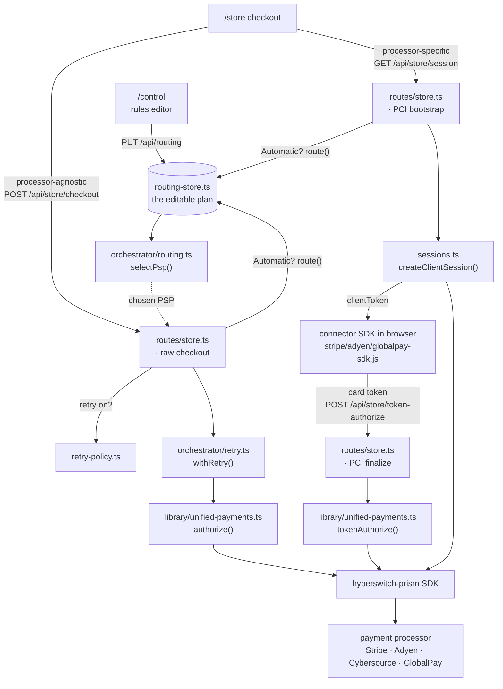

# hyperswitch-prism workshop — code & architecture reference (JS/TS)

**How the JavaScript/TypeScript implementation is built** — the layering, the file map,
and how a payment travels through the code. This is a reference, not a walkthrough:

- **New here?** Start with the **[root README](../README.md)** — it has the workshop
  sequence, one-time setup, and requirements (Node 18/20/22 — **not** 23+).
- **Prefer the terminal?** The **[CLI walkthrough](./CLI-WALKTHROUGH.md)** drives the same
  concepts from the command line.
- **The browser app internals** are in **[web/README.md](./web/README.md)**.

## How it works

```
┌─────────────────────────────────────────────────────────────┐
│  steps/*.ts        — demos you run                          │
├─────────────────────────────────────────────────────────────┤
│  orchestrator/     — routing + retry (pure, processor-free) │
├─────────────────────────────────────────────────────────────┤
│  library/unified-payments.ts — the unified library          │
│      authorize() · capture() · void() · refund()            │
├─────────────────────────────────────────────────────────────┤
│  config/psp-registry.ts   — every PSP lives here            │
│  config/active-psp.ts     — the one-line switch             │
├─────────────────────────────────────────────────────────────┤
│  hyperswitch-prism (npm)  — unified SDK → 100+ processors   │
└─────────────────────────────────────────────────────────────┘
```

The whole point: **application code never names a processor.** Swapping Stripe
for Adyen is a one-line config change; adding a processor is one registry entry.

## Codebase map

Every file, by what it does. The library, orchestrator, and tests live in `config/`,
`src/`, and `test/`; the browser experience lives in `web/`.

```
javascript/
├── config/
│   ├── active-psp.ts          the one-line PSP switch (which processor is "active")
│   └── psp-registry.ts        every PSP + its credentials, read lazily from process.env
│
├── src/
│   ├── library/               ── the unified library ──
│   │   ├── unified-payments.ts   authorize · capture · void · refund + tokenAuthorize (PCI)
│   │   ├── prism-trace.ts        wraps each SDK call → visible "🔷 prism" callout in the logs
│   │   ├── cards.ts              sample test cards (approved/declined) + the Order type
│   │   └── format.ts            console pretty-printing helpers
│   ├── orchestrator/          ── pure, processor-free ──
│   │   ├── routing.ts           selectPsp(): condition-based routing
│   │   └── retry.ts             withRetry(): fall back across PSPs on decline
│   └── steps/                 ── the CLI demos you run (npm run run:*) ──
│       ├── step1-run-payment.ts run a payment through one PSP
│       ├── step2-routing.ts     routing in action
│       ├── step3-retry.ts       retry / fallback in action
│       └── step4-extend.ts      add a new processor / flow
│
├── test/                      routing / retry / unified-payments tests (no keys)
│
└── web/                       browser store + control plane (one Express process)
    ├── server/
    │   ├── index.ts             Express app: serves /store, /control, mounts /api/*
    │   ├── routing-store.ts     declarative rule model → compiles into selectPsp()
    │   ├── retry-policy.ts      global retry/fallback on-off (a control-plane policy)
    │   ├── active-psps.ts       which processors are enabled (add/remove live)
    │   ├── credentials.ts       set a processor's keys at runtime (into process.env)
    │   ├── sessions.ts          PCI session bootstrap for Stripe/Adyen/GlobalPay
    │   ├── control-state.ts     read/write + watch orchestration-config.json (no secrets)
    │   ├── logger.ts            structured, request-correlated server logs
    │   ├── fetch-diagnostics.ts surfaces the Node-23 undici error before the SDK swallows it
    │   ├── products.ts          the store catalog
    │   └── routes/              store.ts · routing.ts · psps.ts · refund.ts  (the /api handlers)
    ├── orchestration-config.json       TRACKED control-plane state — every /control edit writes it;
    │                           hand-edit it and the running UI reloads it (see below)
    └── client/
        ├── shared/styles.css
        ├── store/               index.html, checkout.html, js/{app,checkout, stripe/globalpay/adyen-sdk}.js
        └── control/             index.html, js/control.js  (rules editor + processor panel)
```

The connector SDK handlers (`store/js/{stripe,globalpay,adyen}-sdk.js`) are reused
verbatim from the `juspay/hyperswitch-prism` `demo/e-commerce` store. See
[`web/README.md`](./web/README.md) for the request flows through these files.

## Request flow

How a checkout travels through the code. Both the **processor-agnostic** (raw) and
**processor-specific** (PCI/tokenized) paths converge on the same unified library, and
the `/control` plan is what the router reads on every payment.



The teaching contrast: in the **raw** path the server holds the card, so routing (incl.
card/BIN rules) *and* cross-PSP retry happen server-side. In the **PCI** path routing
resolves earlier — at **session** time — because the browser must load the chosen
connector's SDK before tokenizing, and the resulting token is pinned to that connector
(so no cross-PSP retry). Same unified library at the end of both.

## Two tracks, one core

The [**CLI walkthrough**](./CLI-WALKTHROUGH.md) and the **browser app** drive the *same*
code — editing files / running scripts vs. clicking in `/control`. They meet at one
tracked file, [`web/orchestration-config.json`](./web/orchestration-config.json): every
control-plane change writes it, so it's `git diff`-able and hand-editable (the server
reloads hand edits). The workshop ships it **empty** — no rules, no fallback, no enabled
processors — and you layer the orchestrator in one piece at a time. The follow-along
sequence and per-step diffs are in the [root README](../README.md).

## The PSPs in this workshop

| Key | Processor | Role | Env vars |
|-----|-----------|------|----------|
| `stripe` | Stripe | PSP-1 | `STRIPE_API_KEY` |
| `adyen` | Adyen | PSP-2 | `ADYEN_API_KEY`, `ADYEN_MERCHANT_ACCOUNT` |
| `cybersource` | Cybersource | PSP-3 (a worked "add a processor" example) | `CYBERSOURCE_API_KEY`, `CYBERSOURCE_MERCHANT_ACCOUNT`, `CYBERSOURCE_API_SECRET` |
| `globalpay` | GlobalPay | PSP-4 — **ships commented out**; the Step 7 exercise is to un-comment its one entry in `config/psp-registry.ts` | `GLOBALPAY_APP_ID`, `GLOBALPAY_APP_KEY` |

Credentials are optional (see [*No credentials? Still works*](../README.md#no-credentials-still-works)
in the root README). PSP-specific detail: raw-card mode needs no keys; the store's
processor-specific (PCI) checkout additionally needs **browser** keys
(`STRIPE_PUBLISHABLE_KEY`, `ADYEN_CLIENT_KEY`) — see [`web/README.md`](./web/README.md).
