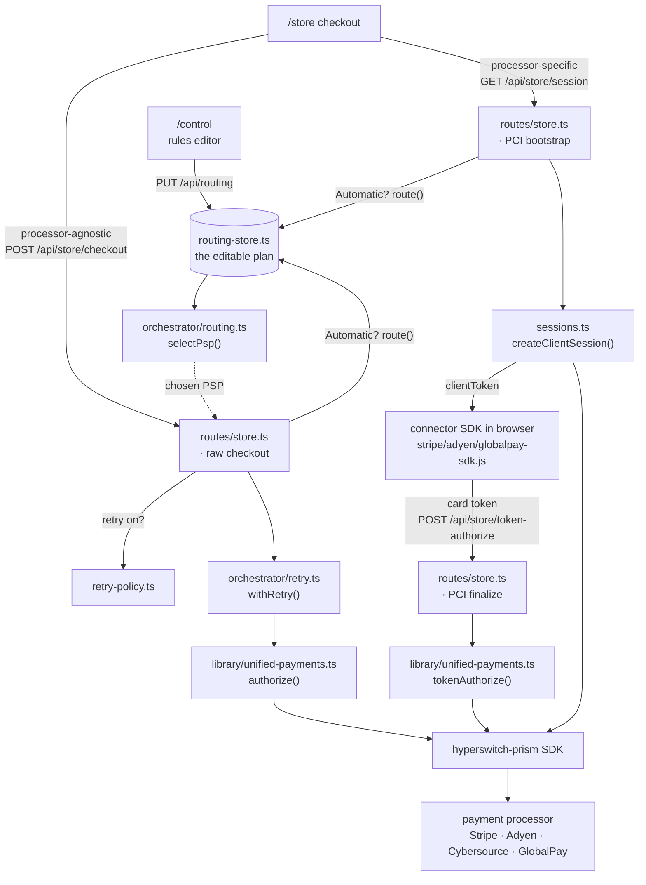

# hyperswitch-prism workshop — JavaScript / TypeScript

A self-contained, runnable workshop that teaches the **hyperswitch-prism**
unified payment library through nine short steps: run a payment with one PSP,
switch processors with a one-line change, build a payment orchestrator
(condition-based routing + retry), extend the library with a new flow/processor,
run a test suite, and drive it all from a browser — an e-commerce store and a
routing control plane.

> 📖 **Follow the guided walkthrough in [STEPS.md](./STEPS.md)** — it maps every
> command below to a workshop step.

## Quick start (from scratch)

```bash
# 1. Clone the workshop repo
git clone https://github.com/juspay/fintech-devcon-workshop.git
cd fintech-devcon-workshop

# 2. Install
cd javascript
npm install
cp .env.example .env        # optional — add sandbox keys to see real approvals

# 3. Run the workshop
npm test                    # Step 8: the test suite (no credentials needed) — start here to verify setup
npm run run:payment         # Steps 1–4: run a payment (switch PSP in config/active-psp.ts)
npm run run:routing         # Step 6a: condition-based routing
npm run run:retry           # Step 6b: payment retry / fallback
npm run run:extend          # Step 7: add a new processor / new flow
npm run web                 # Step 9: browser store + control plane (http://localhost:3000)
```

Then open **http://localhost:3000/store** (storefront + checkout) and
**http://localhost:3000/control** (routing control plane). See
[`web/README.md`](./web/README.md) for the full walkthrough.

Requirements: Git, **Node.js 18, 20, or 22 LTS (not 23+)**, and Linux x64 / macOS /
WSL2 (the SDK ships a native x86_64 library — no Rust toolchain needed). Node 23+
bundles undici 7, which breaks the SDK's `undici@6` HTTP dispatcher and makes every
connector call fail with "Network Error: fetch failed" (`.nvmrc` pins Node 22).

## How it works

```
┌─────────────────────────────────────────────────────────────┐
│  steps/*.ts        — demos you run                          │
├─────────────────────────────────────────────────────────────┤
│  orchestrator/     — routing + retry (pure, processor-free) │
├─────────────────────────────────────────────────────────────┤
│  library/unified-payments.ts — the unified library          │
│      authorize() · capture() · void() · refund()            │
├─────────────────────────────────────────────────────────────┤
│  config/psp-registry.ts   — every PSP lives here            │
│  config/active-psp.ts     — the one-line switch             │
├─────────────────────────────────────────────────────────────┤
│  hyperswitch-prism (npm)  — unified SDK → 100+ processors   │
└─────────────────────────────────────────────────────────────┘
```

The whole point: **application code never names a processor.** Swapping Stripe
for Adyen is a one-line config change; adding a processor is one registry entry.

## Codebase map

Every file, and the workshop step it belongs to. The CLI steps (1–8) live in
`config/`, `src/`, and `test/`; the browser experience (step 9) lives in `web/`.

```
javascript/
├── config/
│   ├── active-psp.ts          Step 3: the one-line PSP switch (which processor is "active")
│   └── psp-registry.ts        Every PSP + its credentials, read lazily from process.env
│
├── src/
│   ├── library/               ── the unified library ──
│   │   ├── unified-payments.ts   authorize · capture · void · refund + tokenAuthorize (PCI)
│   │   ├── cards.ts              sample test cards (approved/declined) + the Order type
│   │   └── format.ts            console pretty-printing helpers
│   ├── orchestrator/          ── pure, processor-free ──
│   │   ├── routing.ts           selectPsp(): condition-based routing (Step 6a)
│   │   └── retry.ts             withRetry(): fall back across PSPs on decline (Step 6b)
│   └── steps/                 ── the demos you run (npm run run:*) ──
│       ├── step1-run-payment.ts run a payment through one PSP        (Steps 1–4)
│       ├── step2-routing.ts     routing in action                   (Step 6a)
│       ├── step3-retry.ts       retry / fallback in action          (Step 6b)
│       └── step4-extend.ts      add a new processor / flow          (Step 7)
│
├── test/                      Step 8: routing / retry / unified-payments tests (no keys)
│
└── web/                       Step 9: browser store + control plane (one Express process)
    ├── server/
    │   ├── index.ts             Express app: serves /store, /control, mounts /api/*
    │   ├── routing-store.ts     declarative rule model → compiles into selectPsp()
    │   ├── retry-policy.ts      global retry/fallback on-off (a control-plane policy)
    │   ├── active-psps.ts       which processors are enabled (add/remove live)
    │   ├── credentials.ts       set a processor's keys at runtime (into process.env)
    │   ├── sessions.ts          PCI session bootstrap for Stripe/Adyen/GlobalPay
    │   ├── control-state.ts     persist plan + enabled set to .control-state.json (no secrets)
    │   ├── logger.ts            structured, request-correlated server logs
    │   ├── fetch-diagnostics.ts surfaces the Node-23 undici error before the SDK swallows it
    │   ├── products.ts          the store catalog
    │   └── routes/              store.ts · routing.ts · psps.ts  (the /api handlers)
    └── client/
        ├── shared/styles.css
        ├── store/               index.html, checkout.html, js/{app,checkout, stripe/globalpay/adyen-sdk}.js
        └── control/             index.html, js/control.js  (rules editor + processor panel)
```

The connector SDK handlers (`store/js/{stripe,globalpay,adyen}-sdk.js`) are reused
verbatim from the `juspay/hyperswitch-prism` `demo/e-commerce` store. See
[`web/README.md`](./web/README.md) for the request flows through these files.

## Request flow

How a checkout travels through the code. Both the **processor-agnostic** (raw) and
**processor-specific** (PCI/tokenized) paths converge on the same unified library, and
the `/control` plan is what the router reads on every payment.



The teaching contrast: in the **raw** path the server holds the card, so routing (incl.
card/BIN rules) *and* cross-PSP retry happen server-side. In the **PCI** path routing
resolves earlier — at **session** time — because the browser must load the chosen
connector's SDK before tokenizing, and the resulting token is pinned to that connector
(so no cross-PSP retry). Same unified library at the end of both.

## The PSPs in this workshop

| Key | Processor | Role | Env vars |
|-----|-----------|------|----------|
| `stripe` | Stripe | PSP-1 | `STRIPE_API_KEY` |
| `adyen` | Adyen | PSP-2 | `ADYEN_API_KEY`, `ADYEN_MERCHANT_ACCOUNT` |
| `cybersource` | Cybersource | PSP-3 (added in Step 7) | `CYBERSOURCE_API_KEY`, `CYBERSOURCE_MERCHANT_ACCOUNT`, `CYBERSOURCE_API_SECRET` |
| `globalpay` | GlobalPay | PSP-4 (added for the web experience) | `GLOBALPAY_APP_ID`, `GLOBALPAY_APP_KEY` |

No credentials? Everything still runs — you'll see the request get built and sent
and a connector error come back instead of a charge. The test suite needs no keys.
The web store's processor-specific (PCI) checkout additionally needs browser keys —
`STRIPE_PUBLISHABLE_KEY`, `ADYEN_CLIENT_KEY` — see [`web/README.md`](./web/README.md).

## Requirements

- **Node.js 18, 20, or 22 LTS** — not 23+ (newer Node bundles undici 7, which breaks
  the SDK's `undici@6` HTTP dispatcher; `.nvmrc` pins Node 22)
- Linux x64, macOS, or Windows via WSL2 (the SDK ships a native x86_64 library)
- No build step — scripts run TypeScript directly via `tsx`
